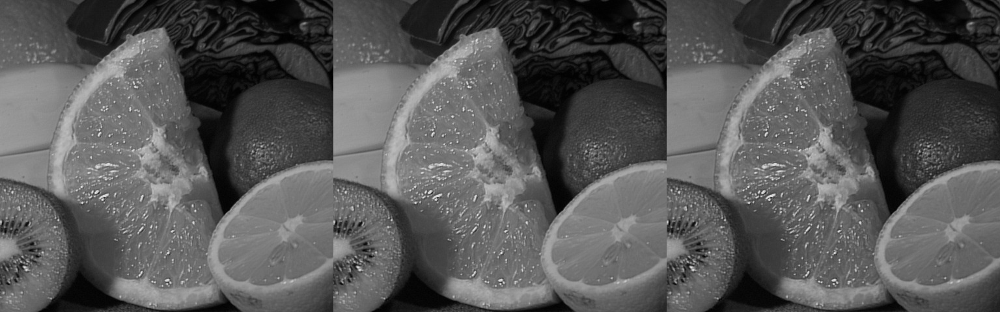
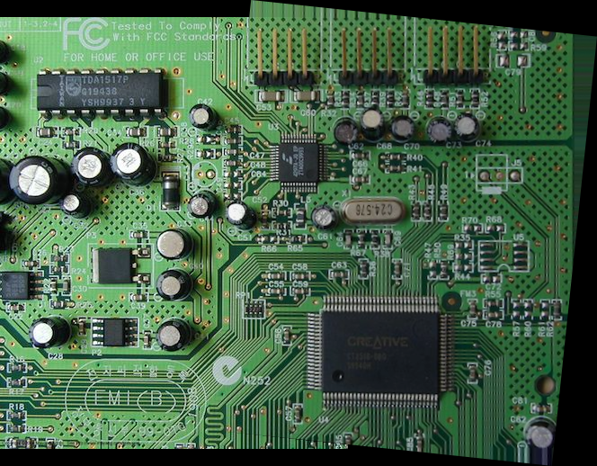

# MMIP：多媒體影像處理 (NYCU) 課堂小測驗紀錄

這個 repo 記錄我跟著課堂投影片，一步一步用 Python + OpenCV + NumPy 完成
4 個小測驗的過程：每題都包含「基礎」跟「進階」需求，並且盡量做到
**自己刻一次演算法、跟現成函式庫比較、量化評估效果**，而不是只呼叫一次
API 交差了事。

| # | 主題 | 連結 |
|---|---|---|
| Quiz 1 | 彩色影像轉灰階影像 | [quiz1_grayscale/](quiz1_grayscale/) |
| Quiz 2 | Histogram Equalization | [quiz2_histogram_equalization/](quiz2_histogram_equalization/) |
| Quiz 3 | 梯形校正與透視轉換 | [quiz3_perspective_transform/](quiz3_perspective_transform/) |
| Quiz 4 | 影像拼接 (SIFT) | [quiz4_image_stitching/](quiz4_image_stitching/) |

每個資料夾都有：`*.py` (可直接執行的完整程式)、`README.md` (概念說明 + 成果 +
學到的東西)、`images/` (輸入影像)、`outputs/` (執行後產生的結果圖 / 圖表 / 數據)。

## 環境設定

```bash
pip install -r requirements.txt
```

用到的套件：`numpy`、`opencv-python-headless`、`opencv-contrib-python-headless`
(要有 SIFT)、`matplotlib`、`scikit-image` (算 SSIM)。

## 4 題內容快速預覽

**Quiz 1 - 灰階轉換**：自己用 NumPy 刻 ITU-R BT.601 加權平均公式
(`0.299R+0.587G+0.114B`)，跟 OpenCV `cvtColor` 比對，99.99% 像素完全相同，
但速度慢了約 50 倍。



**Quiz 2 - Histogram Equalization**：自己刻的版本跟 OpenCV `equalizeHist`
**100% 像素完全相同**，把刻意壓縮到低對比的圖 (標準差 13.5) 拉開到
標準差 74.4、動態範圍滿格 0~255。


**Quiz 3 - 梯形校正**：自己合成「已知斜拍角度」的測試影像 (因為手上沒有
真的斜拍照片可以驗證對錯)，自動抓 4 個角點校正回正視角，並掃過 0°~80°
找出校正效果開始崩潰的角度 (跟影像內容的空間頻率高低有關，見該資料夾 README)。


**Quiz 4 - 影像拼接**：SIFT + RANSAC 拼接電路板照片的兩個重疊裁切區塊，
測試旋轉角度 (幾乎不影響)、重疊率 (低於 5% 開始失敗)、亮度差 (低於 12%
開始失敗)，並示範 CLAHE 前處理如何延後亮度不足造成的失敗。



## 整體學習心得

這次做完 4 題，我對「基礎影像處理演算法」的體感從「課本公式」變成了
「可以自己動手驗證的東西」，幾個比較深的感想：

1. **很多經典演算法真的就是一行數學公式**：灰階轉換是一個線性組合、
   HE 是一個累積分布函數重新縮放。難的從來不是「這行公式怎麼推導」，
   而是**怎麼設計一個公平的實驗去驗證它、量化它的效果**。這也是我這次
   刻意逼自己每一題都要「跟 OpenCV 比對誤差」「跟原圖比 SSIM／標準差」
   「掃參數畫圖找臨界點」的原因——光是跑出一張看起來不錯的圖，
   跟能說出「差多少、什麼時候會壞、為什麼會壞」，是完全不同層次的理解。

2. **「合成測試資料」是驗證影像演算法很實用的技巧**：Quiz 3、Quiz 4
   我手上都沒有「完美對應的測試素材」(真的斜拍照片、真的兩張重疊照片)，
   但透過「已知變換反推」的方式 (自己套用已知的透視變換 / 已知的裁切+旋轉)，
   反而可以做到比真實照片更嚴謹的定量評估，因為我知道「正確答案」長怎樣，
   可以直接算 SSIM、算重投影誤差，而不是只能憑肉眼感覺「校正得準不準」。

3. **每個演算法都有它明確的失效邊界，而且失效原因往往可以說得清楚**：
   HE 會產生梳子狀的直方圖空隙 (離散化的副作用)；透視校正在極端角度下
   會因為可用像素資訊被壓縮到剩一點點而崩潰，而且崩潰的快慢還跟影像本身
   的內容 (高頻細節 vs 平滑漸層) 有關；SIFT 拼接對旋轉幾乎免疫，但對
   重疊率、亮度差異卻有清楚的臨界點，且可以用 CLAHE 這種前處理去把
   臨界點往後推。這種「知道邊界在哪、知道為什麼」的理解，比單純知道
   「這個演算法存在」實用很多，也是我覺得這幾次作業裡收穫最大的部分。

4. **自己刻演算法 vs 呼叫函式庫，兩者都有價值，但價值不一樣**：
   自己刻是為了理解「這行程式碼到底在算什麼」；呼叫 OpenCV 是因為
   人家的實作在效能上(SIMD、C++、多年優化) 根本不是我短時間能追上的。
   這次的比較讓我對「什麼時候該自己刻、什麼時候該直接用現成的」
   有了更具體的判斷依據，而不是憑感覺。

## 圖片來源

所有測試用的原始影像都是 OpenCV 官方 samples repository
(`opencv/opencv/samples/data/`) 裡公開的範例圖 (`fruits.jpg`、`building.jpg`、
`home.jpg`、`board.jpg`)，這些是 OpenCV 專案本身用來示範/測試演算法的公開素材。
