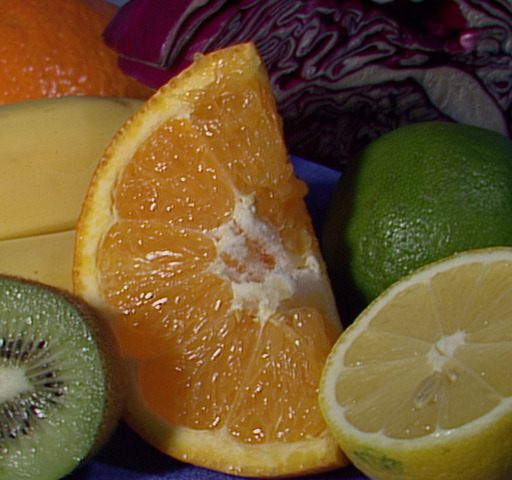
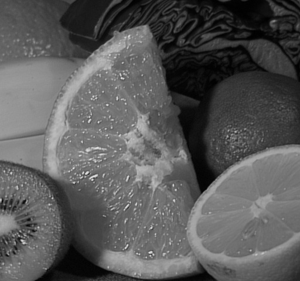
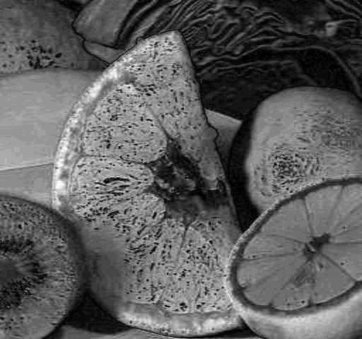

# Quiz 1：彩色影像轉灰階影像

## 這題在做什麼

一張彩色影像在電腦裡是 3 個通道 (R、G、B)，灰階影像只有 1 個通道。
「轉灰階」的重點不是隨便把三個數字合成一個，而是要合成得「像人眼看到的亮度」。

我學到最關鍵的觀念是：**人眼對綠色最敏感、藍色最不敏感**，所以不能三個
通道各取 1/3 平均，而要加權。國際標準 ITU-R BT.601 給的係數是：

```
Gray = 0.299 * R + 0.587 * G + 0.114 * B
```

OpenCV 的 `cv2.cvtColor(img, cv2.COLOR_BGR2GRAY)` 內部用的正是這組係數
(只是它是用整數定點運算加速，不是浮點數)。

## 基礎：RGB → 灰階

用的圖是 OpenCV 官方範例圖 `fruits.jpg` (一堆切開的水果)。

| 原圖 | 灰階結果 |
|---|---|
|  |  |

## 進階：自己刻演算法 vs OpenCV

我用 NumPy 刻了兩個版本：
1. **加權平均法**：完全照 BT.601 公式手算，向量化運算 (整張圖一次算，不寫 for 迴圈跑每個像素，不然會慢到爆炸)。
2. **單純平均法**：`(R+G+B)/3`，故意寫來當對照組，看看「不加權」差多少。

三張圖並排 (左：OpenCV／中：NumPy 加權法／右：NumPy 單純平均法)：


左邊、中間肉眼幾乎看不出差異；右邊 (單純平均法) 仔細看會發現最右邊的紫色高麗菜、
橘子等飽和色區塊的亮度感覺不太一樣，這正是因為忽略了人眼對顏色敏感度不同的緣故。

把「單純平均法 vs OpenCV 加權法」的差異放大 10 倍畫出來，可以清楚看到色彩越飽和、
彩度越高的地方 (紅、紫、綠這些色塊邊界) 差異越大：



### 重複執行 100 次的量化比較

執行 `python3 grayscale.py` 的完整輸出：

```
$ cat outputs/report.txt
```

<details>
<summary>outputs/report.txt 內容</summary>

```
重複執行次數 N = 100

--- 執行速度 (平均每次) ---
OpenCV cvtColor      : 0.0352 ms
NumPy 加權平均法手刻  : 1.8138 ms  (約為 OpenCV 的 51.6 倍)
NumPy 單純平均法手刻  : 5.1937 ms  (約為 OpenCV 的 147.7 倍)

--- 轉換結果差異 (NumPy 加權法 vs OpenCV) ---
平均絕對誤差 MAE : 0.000138
最大絕對誤差 Max : 1
完全相同的像素比例: 99.99%

--- 轉換結果差異 (NumPy 單純平均法 vs OpenCV 加權法) ---
平均絕對誤差 MAE : 9.386768
最大絕對誤差 Max : 29
```

</details>

### 我學到的三件事

1. **公式對了，實作幾乎就對了**：我手刻的加權平均法跟 OpenCV 的結果 99.99% 像素完全一樣，
   剩下 0.01% 只差 1 (是四捨五入方式跟 OpenCV 內部用定點數近似造成的誤差)。這讓我很有成就感——
   原來「灰階轉換」這種聽起來很基礎的影像處理，核心就是一行線性公式。
2. **向量化運算 vs 底層優化的速度差距很現實**：就算我全部用 NumPy 向量化 (完全沒寫 Python 迴圈)，
   還是比 OpenCV 慢了 50 倍。OpenCV 底層是 C++ 寫的，還用 SIMD 指令平行處理多個像素，
   這讓我體會到「演算法一樣，實作語言/底層優化不一樣，效能可以差好幾十倍」。
3. **權重不是隨便訂的**：拿掉權重、改用單純平均，平均誤差就從 0.0001 跳到 9.4，
   最大誤差到 29 (灰階值 0~255 的量級)，證明加權係數確實是有科學根據 (人眼感光特性)，
   不是工程師隨手選的參數。

## 如何重現

```bash
cd quiz1_grayscale
python3 grayscale.py
```

輸出會存到 `outputs/`。
