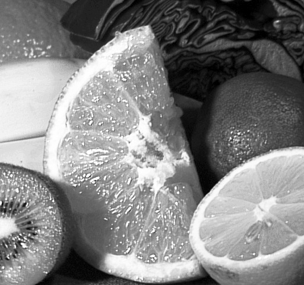
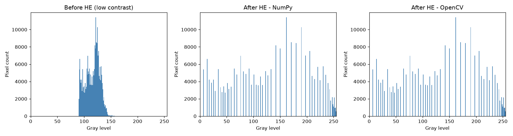

# Quiz 2：Histogram Equalization

## 這題在做什麼

如果一張照片曝光不足、起霧，或是整體看起來灰濛濛的，代表它的灰階值都擠在
一個很窄的區間內 (例如都在 90~160 之間，而不是用滿 0~255)。

Histogram Equalization (直方圖等化) 的想法是：把這些擠在一起的灰階值，
「拉開」到整個 0~255 的範圍，讓暗的更暗、亮的更亮，對比看起來更清楚。

它的數學做法是：
1. 統計每個灰階值出現幾次 → histogram
2. 累加起來 → CDF (累積分布函數)，CDF 天生就是「單調遞增」的
3. 把 CDF 正規化縮放到 0~255 → 這就是新的灰階對應表 (LUT)
4. 用這張對應表把每個像素重新著色

CDF 单调递增這個特性很關鍵，它保證了「原本比較亮的像素，處理後也一定比較亮」，
不會把亮暗順序打亂，只是把分布拉開。

## 基礎：提升對比與繪製前後 Histogram

我用 Quiz 1 的 `fruits.jpg` 灰階圖，但故意把它的動態範圍「壓縮」到 90~165 之間
(模擬起霧/曝光不足)，這樣才看得出 HE 到底有沒有效果——如果直接拿一張本來就
對比正常的照片來測，效果不會明顯。

| 處理前 (低對比) | 處理後 (HE) |
|---|---|
|  |  |

處理前後的灰階直方圖：



左圖可以看到所有像素都擠在 90~165 之間；右邊兩張 (NumPy 手刻 vs OpenCV) 處理後，
像素值被拉開到接近整個 0~255 的範圍，而且長得一模一樣。

## 進階：NumPy 手刻 vs OpenCV `equalizeHist`

自己刻的版本完全照上面 4 個步驟寫，唯一要注意的細節是課本公式裡的
`cdf_min` (第一個非零的累積值) 不能漏掉，不然暗部會對應錯誤：

```python
lut = round((cdf - cdf_min) / (total_pixels - cdf_min) * 255)
```

### 重複執行 100 次的量化比較

<details>
<summary>outputs/report.txt 內容</summary>

```
重複執行次數 N = 100

--- 動態範圍 / 對比度 (標準差) ---
處理前 (低對比輸入)        : range=70, std=13.46
處理後 - NumPy 手刻 HE     : range=255, std=74.43
處理後 - OpenCV equalizeHist: range=255, std=74.43

--- 執行速度 (平均每次) ---
NumPy 手刻 HE      : 1.1852 ms
OpenCV equalizeHist: 0.2666 ms  (NumPy 約為 OpenCV 的 4.4 倍)

--- 轉換結果差異 (NumPy vs OpenCV) ---
平均絕對誤差 MAE : 0.000000
最大絕對誤差 Max : 0
完全相同的像素比例: 100.00%
```

</details>

三張圖並排 (左：低對比原圖／中：NumPy HE／右：OpenCV HE)：


### 我學到的三件事

1. **這次兩個實作是「完全一樣」的結果 (100% 像素相同)**，跟 Quiz 1 灰階轉換
   還有 1 個像素灰度值的誤差不同。原因是 HE 的公式是整數運算為主 (histogram 計數、
   累加都是整數)，不像灰階轉換牽涉到浮點數加權再四捨五入，所以只要照課本公式刻，
   結果會跟 OpenCV 完全一致，沒有數值誤差空間。
2. **對比度的量化指標**：標準差從 13.46 衝到 74.43，動態範圍從 70 衝到 255 (滿格)，
   這讓我學會不能只靠肉眼「感覺變清楚了」，而是可以用標準差、動態範圍這些數字
   具體描述「對比度提升了多少」。
3. **HE 後的直方圖會出現「梳子狀」的空隙** (看上面 histogram 圖中間、右邊兩張)：
   因為原本擠在一起的灰階值被拉開對應到新的位置，但灰階值本身是離散的整數，
   拉伸後有些新的灰階值就沒有任何像素對應到，形成一根根的「牙籤」加上中間的空白。
   這是 HE 這個演算法的已知副作用 (相對於後來課堂可能會教的 CLAHE 等改良版本)，
   親眼看到這個現象比課本文字描述有感覺多了。

## 如何重現

```bash
cd quiz2_histogram_equalization
python3 hist_eq.py
```
