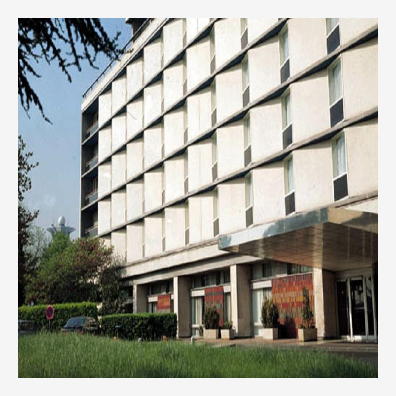
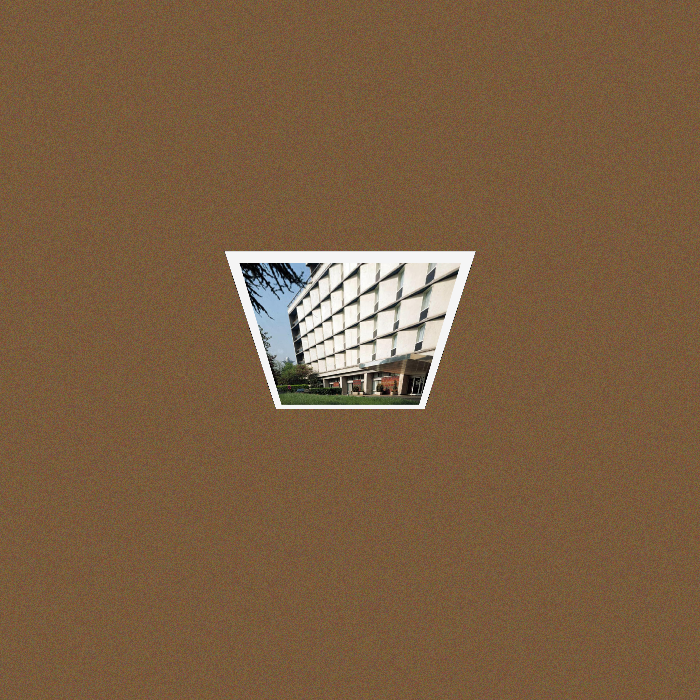
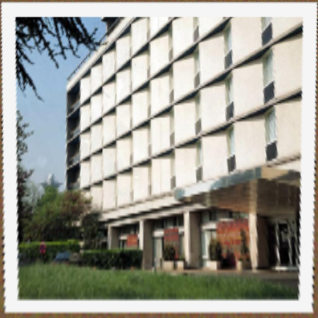
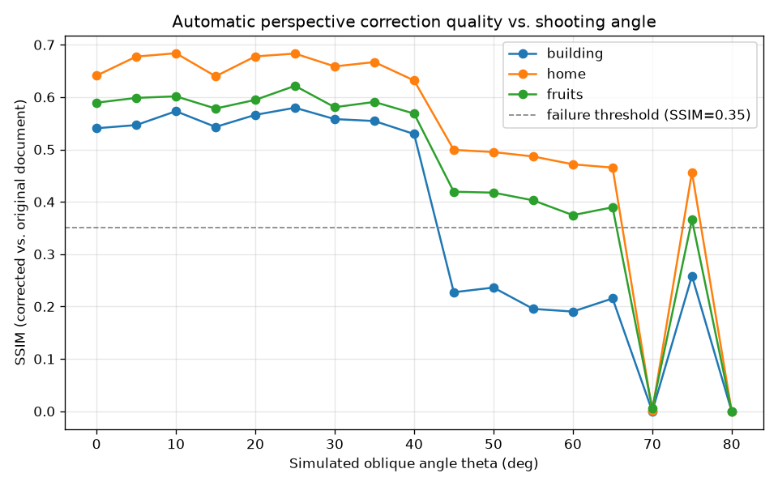
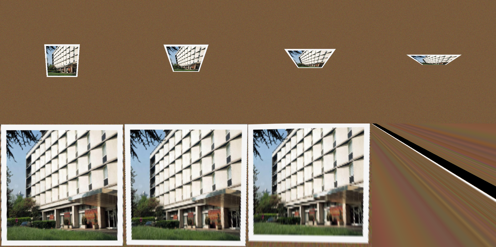

# Quiz 3：梯形校正與透視轉換 (Perspective Transformation)

## 這題在做什麼

拍文件、拍白板常常沒辦法完全正對著拍，斜斜拍出來的矩形物體在照片裡會變成梯形。
Perspective Transformation (透視轉換) 就是找出「原本 4 個角點」跟「斜拍後這 4 個角點跑到哪裡」
的對應關係，算出一個 3x3 的變換矩陣 H，再把整張照片透過 H「攤平」回正視角。

## 我遇到的問題：手上沒有真的斜拍照片

我沒有一張「斜拍文件 + 已知正確答案長怎樣」的照片可以驗證校正得準不準，所以採用
教科書常見的驗證方式：**自己合成**。

流程：
1. 拿一張真實照片 (`building.jpg`，OpenCV 官方範例圖) 當作「文件內容」，加白框做成一張
   看起來像照片/文件的正方形圖。
2. 用簡化的針孔相機投影公式，模擬「鏡頭傾斜 θ 度看這個平面」時，4 個角點會落在畫布的哪裡，
   把文件透視變形貼到一個木紋背景畫布上 → 這就是「模擬斜拍照片」。
3. 因為第 2 步是我自己算的，所以「正確答案」(校正後應該長怎樣) 我是知道的，
   可以拿校正結果跟原始文件算 SSIM (結構相似度) 來客觀評分，而不是憑感覺說「看起來還不錯」。

這樣做的好處是可以量化評估、可以大量自動化測試很多角度，缺點是終究是模擬的，
跟真實世界的鏡頭畸變、光影變化還是有差距。

## 基礎：偵測角點 + 校正回正視角

角點偵測用的是經典的「文件掃描」演算法：灰階 → 高斯模糊去雜訊 → Canny 邊緣偵測 →
膨脹補邊緣的洞 → 找輪廓 → 依面積排序 → 用 `approxPolyDP` 找第一個近似成 4 邊形的輪廓，
就是文件的 4 個角。找到角點後排序成 (左上/右上/右下/左下)，再用
`cv2.getPerspectiveTransform` + `cv2.warpPerspective` 校正回正方形。

以模擬斜拍 38 度為例：

| 原始文件 | 模擬斜拍照片 | 自動偵測到的角點 | 校正後 |
|---|---|---|---|
|  |  |  |  |

校正後跟原始文件的 SSIM = **0.52**。校正結果看起來已經相當接近正視角，
邊緣有一點鋸齒是因為透視變形做內插造成的。

## 進階：自動化跑多張影像 x 多個角度，找出失效的臨界點

我對 3 張內容完全不同的影像 (`building`、`home`、`fruits`) 各自套用 0 度到 80 度、
每 5 度一組的斜拍模擬，全自動跑完「合成斜拍 → 偵測角點 → 校正 → 算 SSIM」，
一次產生 3 x 17 = 51 筆結果，不用手動點任何一個角點：



用 `building` 當例子，挑幾個角度看實際校正結果 (上排是模擬斜拍照片，下排是校正結果，
角度分別是 10 / 40 / 60 / 75 度)：



可以清楚看到：10 度時校正結果跟原圖幾乎一樣；40 度時開始看得出模糊/拉伸；
到了 75 度，畫面幾乎完全碎裂成一條條的色帶——這就是校正演算法徹底失效的樣子。

### 各影像第一次「失效」(SSIM < 0.35) 發生在幾度

| 影像 | 失效角度 |
|---|---|
| building | 45 度 |
| home | 70 度 |
| fruits | 70 度 |

### 我學到的三件事 (以及一個一開始沒想到的發現)

1. **為什麼角度越大校正越差**：斜拍角度越大，文件在照片裡被壓縮得越扁 (遠離鏡頭那條邊
   被壓縮成很短一小段)。校正時要把這一小段像素「放大」回原本的尺寸，等於是用很少的
   像素資訊去重建很大範圍的內容，內插誤差、模糊、鋸齒都會被放大，SSIM 自然崩掉。
   角度越極端，這個「資訊被壓縮到只剩一點點」的效應越嚴重，直到某個角度後幾乎沒有
   可用資訊，校正結果就變成上面看到的碎片狀色帶。
2. **同樣的傾斜幾何，不同內容失效的角度居然不一樣** (building 45 度 vs home/fruits 70 度)——
   這是我一開始沒預期到的。後來想通：building 的內容是密集的窗框格子 (高頻細節)，
   對「一點點的角點誤差、一點點的內插模糊」非常敏感，稍微校正不準，格線就對不齊，
   SSIM 立刻掉很多；而 home、fruits 內容比較平滑 (天空、果肉的漸層)，同樣程度的
   校正誤差對 SSIM 的影響比較小。這讓我理解到「演算法失效的角度」不是單純幾何問題，
   跟影像本身的內容 (空間頻率) 也有關係。
3. **自動角點偵測本身也是有失效條件的**，不是只有校正品質變差而已：角度夠大時，
   Canny 找到的邊緣輪廓可能因為對比度不足、或形狀太扁 `approxPolyDP` 抓不出乾淨的
   4 邊形，導致偵測直接失敗 (這種情況我在程式裡讓 SSIM 直接記為 0，圖上可以看到
   幾個角度分數是斷崖式的 0)。這跟「偵測到角點但校正得不準」是兩種不同的失效模式，
   前者是「完全沒找到門」，後者是「找到門但量錯門的大小」。

## 如何重現

```bash
cd quiz3_perspective_transform
python3 perspective.py
```

輸出 (含所有中間結果與 `advanced_summary.json` 完整數據) 會存到 `outputs/`。
