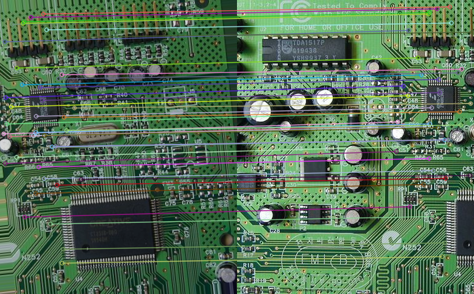
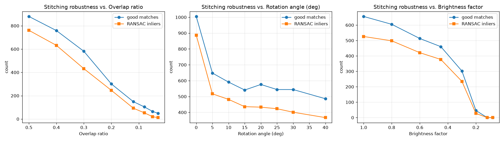
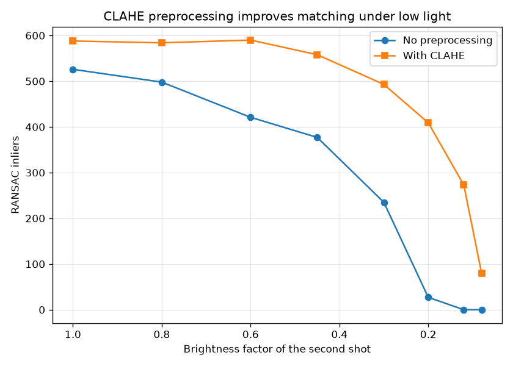

# Quiz 4：影像拼接 (Image Stitching)

## 這題在做什麼

兩張有重疊區域的照片，要怎麼自動接成一張全景圖？核心流程是：

1. **特徵偵測**：用 SIFT 找出兩張圖裡「有辨識度的關鍵點」(角點、紋理特殊的地方)，
   每個關鍵點會有一個描述它周圍長相的向量 (descriptor)。
2. **特徵匹配**：把兩張圖的關鍵點兩兩比對，找出「長得很像」的配對。這裡用了
   Lowe's ratio test (只留下最佳匹配明顯比次佳匹配好的配對，過濾掉模稜兩可的錯誤配對)。
3. **估計 Homography**：就算做了 ratio test，匹配裡還是會混著錯誤配對 (outlier)。
   用 RANSAC 隨機取樣、投票找出一個大家都同意的透視變換矩陣 H，同時得到哪些配對是
   "inlier" (符合這個 H 的配對)。
4. **warp + 混合**：把第二張圖用 H 投影到第一張圖的座標系，重疊區用羽化 (feather) 混合，
   避免接縫太明顯。

## 手上沒有兩張真的重疊照片，怎麼測試？

我從同一張紋理豐富的照片 (`board.jpg`，一張電路板特寫，上面有很多獨特的元件、
剛好適合 SIFT 找特徵點) 切出左右兩塊有重疊的區域，並且對右半邊做「模擬第二次拍攝」
的擾動 (旋轉、調亮度)，這樣才能有系統地控制「重疊率」「拍攝角度差」「亮度差」
這幾個變因，一個一個測試對拼接的影響。

## 基礎：SIFT 特徵匹配 + 拼接

基礎示範用重疊率 35%、右圖旋轉 6 度、亮度乘 0.85 (模擬光線稍微暗一點) 的組合：

- 左圖關鍵點數：2534，右圖關鍵點數：3851
- ratio test 後的匹配數：630
- RANSAC 後的 inlier 數：513 (inlier 比例 81.4%)
- 平均重投影誤差：0.13 像素 (代表估計出來的 H 非常準確)

隨機挑 40 條 inlier 連線畫出來 (可以看到左右兩張圖裡同一個電容、同一個晶片被正確配對)：



拼接結果 (用羽化混合處理接縫)：


拼接後看不太出接縫，右半邊的旋轉、亮度差異都被 homography 跟混合處理掉了。

## 進階：調整亮度／角度／重疊率，找出失效的臨界點

以基礎示範的參數為預設值，每次只調整一個變因，看 SIFT 匹配數與 RANSAC inlier 數的變化：



| 變因 | 測試範圍 | 開始拼接失敗 (inlier < 8 或 inlier 比例 < 50%) |
|---|---|---|
| 重疊率 | 50% → 3% | **5%** 以下開始失敗 |
| 拍攝角度差 | 0° → 40° | 整個測試範圍內都沒有失敗 |
| 亮度倍率 | 1.0 → 0.08 | **0.12** (只剩 12% 亮度) 以下開始失敗 |

### 前處理：用 CLAHE 改善低光源下的匹配穩定性

在亮度掃描的基礎上，比較「有沒有先做 CLAHE (對比受限自適應直方圖等化)」的差異：



在亮度掉到 0.2 (剩 20%) 時，沒有前處理只剩 27 個 inlier，加了 CLAHE 還有 411 個；
亮度掉到 0.12 時，沒有前處理已經完全找不到 inlier (0 個)，加了 CLAHE 還能找到 275 個。
CLAHE 把區域性的對比度拉開，讓在暗部也能保留足夠的紋理細節給 SIFT 抓特徵點，
明顯延後了「亮度不足導致拼接失敗」的臨界點。

### 我學到的三件事

1. **旋轉角度對 SIFT 幾乎沒有威脅**：測到 40 度旋轉，inlier 比例都還維持在 74~88%，
   完全沒有失敗。這正是 SIFT 設計時的核心賣點之一——「尺度不變、旋轉不變」
   (Scale-Invariant Feature Transform 名字裡的 Invariant 不是叫假的)，每個關鍵點
   在算描述向量前，會先依照自己的主方向把周圍區域「轉正」再描述，所以兩張圖just算是
   彼此有旋轉關係，descriptor 還是長得很像。
2. **重疊率才是真正的硬限制**：重疊率降到 5% 以下才失敗看似「還好」，但仔細看數據，
   從 50% 到 12% 這段，inlier 數已經從 761 一路崩到 93，是斜率最陡的區段。這讓我理解
   「重疊區域大小」直接決定了兩張圖裡「同時出現、可以互相對應」的關鍵點數量上限，
   這是特徵匹配類拼接演算法沒辦法迴避的物理限制——沒有共同看到的內容，
   再厲害的特徵點演算法也匹配不出東西。
3. **亮度差異影響的不是「找不找得到特徵點」而是「找到的特徵點還匹不匹配得起來」**：
   SIFT 的 descriptor 本身對線性亮度變化有一定的正規化能力 (所以亮度乘 0.3 都還有
   235 個 inlier)，但差異大到一定程度 (剩不到 20% 亮度)，暗部的雜訊 / 量化誤差
   會嚴重扭曲局部梯度方向，descriptor 就跟原本對不上了。而 CLAHE 之所以有效，
   是因為它不是整張圖一致地拉對比，而是分成很多小格子各自拉伸對比，
   剛好補償了「暗部細節被壓縮」這件事，讓 SIFT 重新看得到暗部的紋理。

## 如何重現

```bash
cd quiz4_image_stitching
python3 stitching.py
```

輸出 (含所有中間結果與 `advanced_summary.json` 完整數據) 會存到 `outputs/`。
